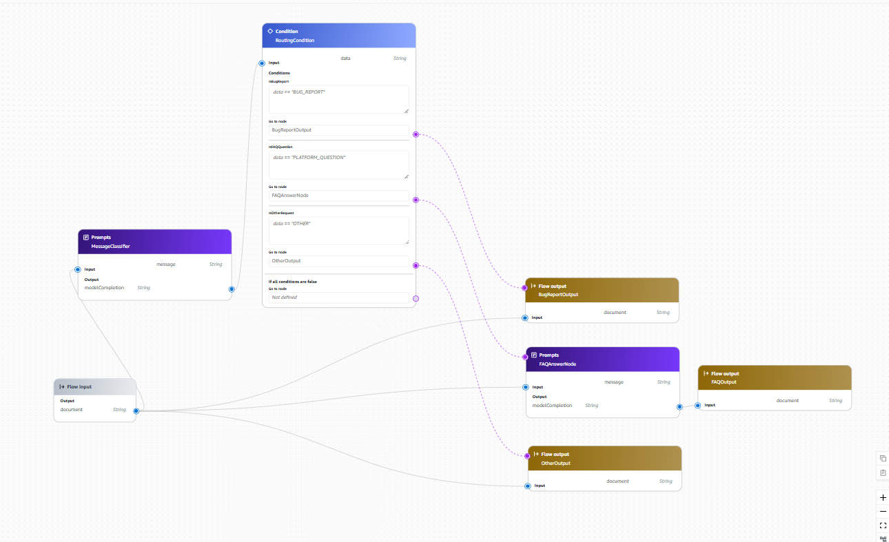
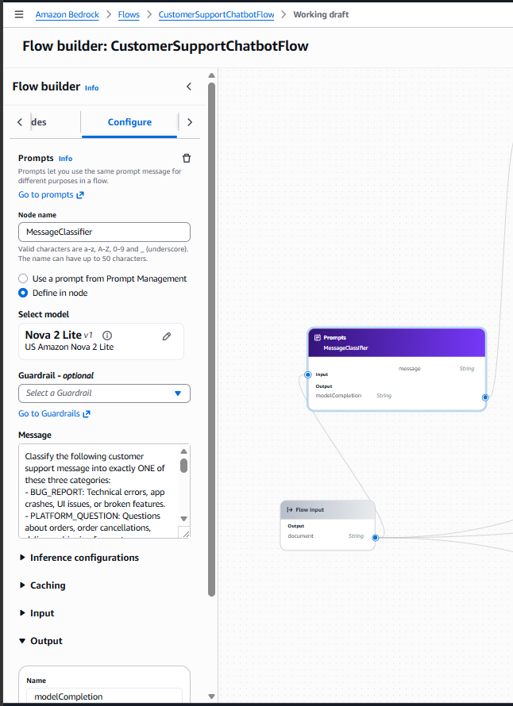
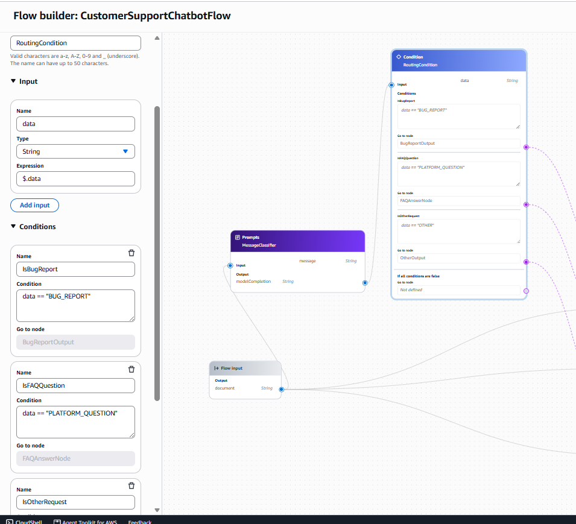
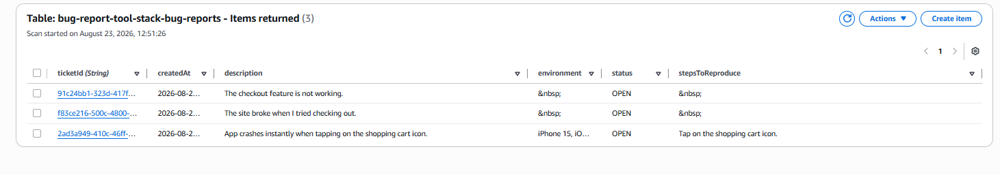
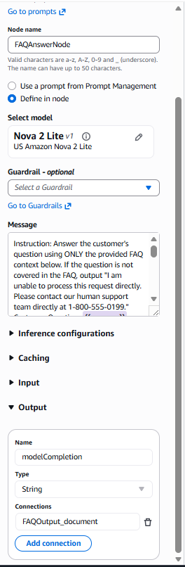
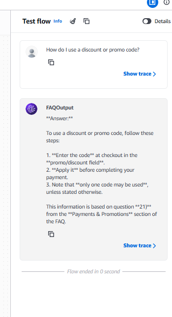
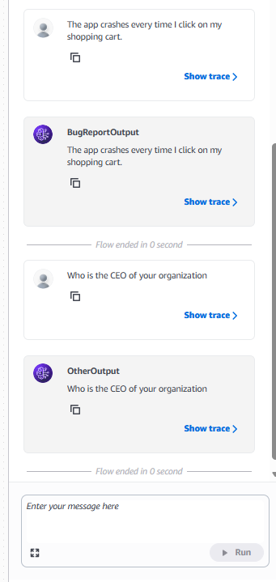
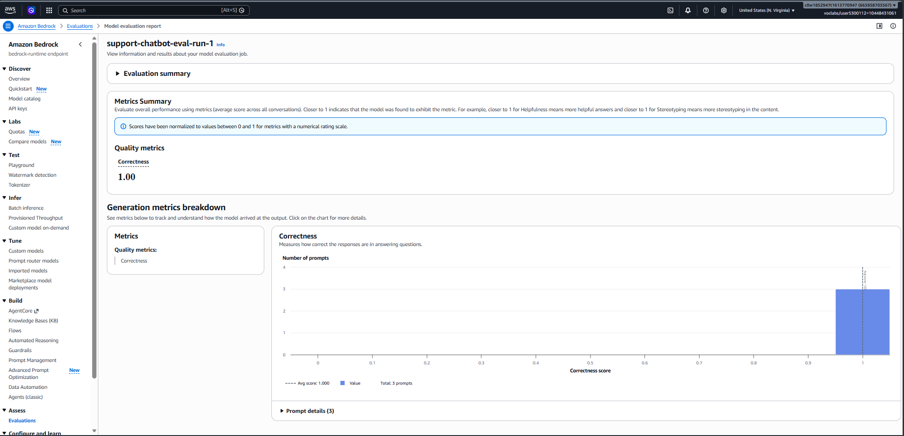

# AWS Bedrock Support Chatbot Evaluation & Implementation

This repository contains the completed implementation and evaluation suite for the AWS Bedrock Support Chatbot project.

---

## 1. Classification & Routing

The Bedrock Flow evaluates customer queries and routes them to one of three distinct branches: Bug Reports, Platform Questions (FAQ), or Other Requests.

* **Full Flow Diagram:**
  

* **Classifier Prompt Configuration:**
  

* **Condition Node Expressions:**
  

---

## 2. Bug Report Path

Bug reports are processed using system prompt guidance and persistent storage via DynamoDB.

* **System Prompt Rules:** Defined in [`system_prompt.txt`](./system_prompt.txt).
* **Interactive Chat Transcript:** Generated via `chat.py` showing `[tool call] bugreports___create_bug_report`.
* **DynamoDB Record Evidence:**
  

---

## 3. Platform Questions & Other Requests

* **FAQ Prompt Node Template:**
  

* **Flow Test Responses:**
  * **Covered Question (FAQ match):**
    
  * **Uncovered and Other Question**
    

---

## 4. Testing & Bedrock Evaluation Results

### Test Artifacts
* `flow-tests.json` contains automated test definitions for all three paths.
* `output_eval_dataset.jsonl` contains the model responses evaluated by LLM-as-a-judge.

### Evaluation Job Details
* **Job Name:** `support-chatbot-eval-run-1`
* **Evaluator Model:** Amazon Nova Pro (`amazon.nova-pro-v1:0`)
* **Metric:** `Builtin.Correctness`

### Written Evaluation Observation
The automated Bedrock Evaluation job achieved a **Builtin.Correctness** score close to **1.0**. The evaluator model (`amazon.nova-pro-v1:0`) verified that:
1. **Bug Report path:** The agent systematically collected steps to reproduce, environment information, and bug descriptions before invoking the tool.
2. **Platform Questions path:** Covered queries were answered accurately using the embedded FAQ context, while uncovered queries gracefully redirected users to the support phone number.
3. **Other Requests path:** Non-technical customer service requests were properly directed to phone support without hallucinations.